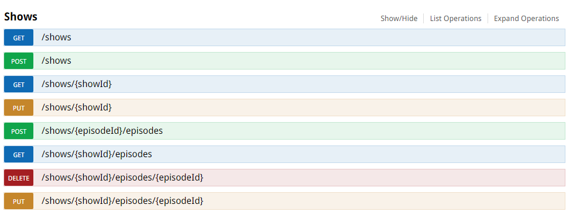

Bluebeam Software, Inc.

55 South Lake

Pasadena, CA 91101

# What is Bluebeam looking for in a *Back-End Developer*?

We are looking for talented software engineers that understand both SOA and CAA because we offer both Enterprise and Cloud system offerings.

Really, it all boils down to the following:
* We want engineers that can build new services or integrate existing services with ease
* We want engineers that understand how to scale services vertically (up) and horizontally (out)
* We want engineers that can design algorithms at scale and understand time and space complexity well
* We want engineers that know how to build software using SOLID principles
* We want engineers that are familiar with design patterns (i.e. Gang of Four) and have a firm understanding of object oriented programming
* *Most importantly* we want engineers that are quick learners and can apply their knowledge to solve difficult problems

## What can I expect from a *Back-End Developer* position?

As a *Back-End Developer*, you will be an integral part of the **Studio Team** and will be enhancing/extending the realtime collaboration services that integrate tightly with our flagship product **Revu**. Studio is powered by AWS technologies and so you will have cloud computing at your fingertips.

# Homework Problem for Back-End Developer Position

It's been a long week! You have been so busy and its time to relax; so you plop yourself in front of your TV and realize you can't decide what to watch! You think to yourself, "Jon mentioned this really cool show earlier... what was it called again?" Now you can just call him, *OR* you can let the new TV service *NetFace* figure out what to watch for you.

In this homework assignment, you will design a subset of the features for the *NetFace* service that will help solve the problem of deciding what to watch. *NetFace* is a combination of *Netflix* and *Facebook* where users sign in and make friends. At the same time, each user tracks their favorite TV shows. The idea is that users might like the same TV shows as their friends, and when they can't decide what to watch, they can tune into their friend's channel to watch new stuff. They can also tune into their own channel and let *NetFace* figure out what the TV line up should be.

Finally, no more scrolling through endless TV shows for hours only to give up and watch nothing!

## Okay, how does this work?

We provide you with an .NET Web API project to extend (it uses an in memory data store). You will be designing the data structures and methods on the back end to materialize the following features:
* Registering friends
* Registering a user's favorite TV shows
* Creating the TV Channel Line-Up

You are **not required** to use any external dependencies; however, if you feel you must, then by all means do so!
When you submit your assignment, please let us know how to set it up (ideally, you should provide us with a README and script to run).

We start you off with a couple of key resources: *users* and *shows*.

### Users

Users are the fundamental units at *NetFace*. They literally represent the people consuming of the service. We hook you up with the following API (extend it how you see fit).


### Shows

Shows (i.e. TV shows) are another fundamental unit at *NetFace*. They literally represent the available TV shows that users have access to. We hook you up with the following API (extend it how you see fit).




## What you will build

You can change any part of the *NetFace* service to accomplish your goals:
* Registering a user's friends
* Registering a user's favorite TV shows
* Producing a channel line up for the following scenarios:
 * A given user
 * A given user and their immediate friends
 * A given user and all their potential friends (i.e. if you are friends with Tim and Tim is friends with Eric then you would create a channel line up of the favorite shows between you, Tim and Eric--and it would be a Great Job!)

You can get a visual of your API by visiting http://localhost/swagger/ui/index whenever you build.

Ultimately, we want to request something that looks like this:
```
GET http://localhost/users/1/channels/1/lineup
```
So that it returns something that might look like this (we leave the design decision to you):
```
[
    {
        "Name": "Breaking Bad",
        "Episode": "Over"
    },
    {
        "Name": "Breaking Bad",
        "Episode": "4 Days Out"
    },
    {
        "Name": "House of Cards",
        "Episode": "Chapter 1",
    },
    {
        "Name": "House of Cards",
        "Episode": "Chapter 2"
    }
]
```

That's a line up of about 3-4 hours of awesome TV!

## Where do I get the code from?

Simply clone this repository and start coding.

```
git clone https://github.com/bluebeamdev/backenddev.git
```

## What you will submit

Please create a zip file and send it over to the recruiter when you are finished. It should include the following:
* Your Solution folder and projects
* A README file with examples on how to use your API and anything you want to address (i.e. concerns, open questions, etc.)

## What we expect

This problem is purposefully vague and there are many possible solutions.
There is no right or wrong answser. We want to see your ability to solve problems.
That being said, don't leave anything out. We will be going over everything!

Have fun and good luck!
