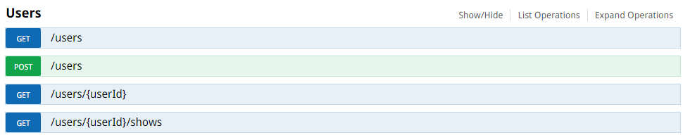

Bluebeam Software, Inc.

55 South Lake

Pasadena, CA 91101

# What is Bluebeam looking for in a *Back-End Developer*?

We are looking for talented software engineers that understand both SOA and CAA because we offer both Enterprise and Cloud system offerings.

Really, it all boils down to the following:
* We want engineers that can build new services or integrate existing services with ease
* We want engineers that understand how to scale services vertically (up) and horizontally (out)
* We want engineers that can design algorithms at scale and understand time and space complexity well
* We want engineers that know how to build software using SOLID principles
* We want engineers that are familiar with design patterns (i.e. Gang of Four) and have a firm understanding of object oriented programming
* *Most importantly* we want engineers that are quick learners and can apply their knowledge to solve difficult problems

## What can You expect from a *Back-End Developer* position?

As a *Back-End Developer*, you will be an integral part of the **Studio Team** and will be enhancing/extending the realtime collaboration services that integrate tightly with our flagship product **Revu**. Studio is powered by AWS technologies and so you will have cloud computing at your fingertips.

# Homework Problem for Back-End Developer Position

How would you will design the data structures for a very large social network like Facebook or LinkedIn? Describe how you would design an algorithm to show the connection between two people (e.g., Me -> Bob -> Susan -> Jason -> You).

We provide you with an .NET Web API project to extend (it uses an in memory data store). You will be designing the data structures and methods on the back end to materialize the following features:

* Ability to friend and unfriend people
* Get a list of a user's friends
* Get a list of a user's potential friends (this addresses the question above directly)

We will start you off with the key resource *users*:



You can get a visual of your API by visiting http://localhost/swagger/ui/index whenever you build.

The rest is up to you. Good luck!

## Where do I get the code from?

Simply clone this repository and start coding.

```
git clone https://github.com/bluebeamdev/backenddev.git
```

## What you will submit

Please create a zip file and send it over to the recruiter when you are finished. It should include the following:
* Your Solution folder and projects
* A README file with examples on how to use your API and anything you want to address (i.e. concerns, open questions, etc.)

## What we expect

There is no right or wrong answser. We want to see your ability to solve problems.
That being said, don't leave anything out. We will be going over everything!

Have fun and good luck!
